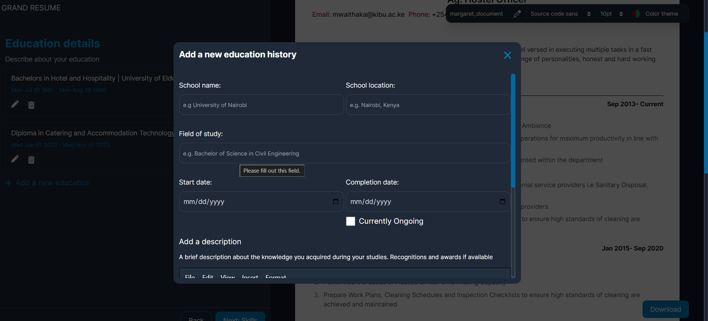

# The Grand Resume

An online resume builder built using Vue JS and Typescript

## Introduction
The Grand Resume has been built to enable Jobseekers to quickly
and easily generate ATS-Friendly resumes which are downloadable
as PDF. <br>
The live version of the project has been hosted using
Netlify and can be found at [The Grand Resume.](https://grandresume.netlify.app/)
The Grand Resume has been built by [Joshua Nyawach.](https://www.linkedin.com/in/joshua-nyawach/)
He recently published a blog articles to explain how The GRand Resume
work. Check it out [here](https://grandresume.netlify.app/about)

## Installation
The application required [Node 18+ ](https://nodejs.org/en) installed on you computer 
to run. 
```
git clone https://github.com/Jnyawach/cv-builder.git
cd into the folder
npm install
npm run dev
```

## Usage
The Grand Resume is available online for free usage. 
You can access the resume builder by clicking on the resume
builder link in the top left corner.<br>
The steps toward creating your resume are descriptive
and easy to follow

## Contribution
If you wish to contribute to this project, you can do so by forking
the [repo](https://github.com/Jnyawach/cv-builder.git) and making your changes.
Thereafter, you can create a pull request which will undergo review


## Licensing

The Grand Resume is an opensource Project licensed under the [MIT License](https://opensource.org/licenses/MIT)

